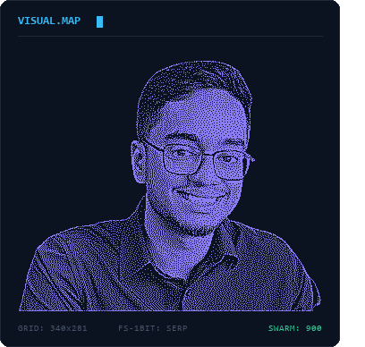

<picture>
  <source media="(prefers-color-scheme: dark)" srcset="assets/title-dark.svg" />
  <source media="(prefers-color-scheme: light)" srcset="assets/title-light.svg" />
  
</picture>

<b>Full-Stack &amp; AI Automation Developer</b> · Dhaka, Bangladesh

🎓 B.S. Computer Science &amp; Engineering, East West University (2028) 
🌍 Building <b>HB-IMIS</b> for HOPE Worldwide Bangladesh 
🤖 LLM pipelines, retrieval &amp; evidence-grounded AI 
💼 Open to internships &amp; junior roles

 

---

## 🧭 About

- 🤖 I work on **AI & automation**: LLM pipelines, retrieval, and evidence-grounded generation where every claim traces back to a source.
- 🌍 Currently building **HB-IMIS**, an integrated management information system for **HOPE Worldwide Bangladesh** — education, school health and vocational programmes under one roof.
- 🛍️ Also shipping a production **Next.js + Stripe storefront** for a family business that hand-makes jute and leather bags in Bangladesh.
- 📱 Learning native Android with **Jetpack Compose + Material 3**.
- 💬 Happy to talk about FastAPI, Postgres + pgvector, Next.js, or keeping an LLM honest.
- 📫 **jasondhaki05@gmail.com**

---

## 🛠️ Tech Stack

**Languages**

**Frontend**

**Backend &amp; Data**

**Tools &amp; Platforms**

---

## 🚀 Featured Projects

<table>
<tr>
<td width="50%" valign="top">

### 🧠 AI5K — Profile Intelligence
Extracts evidence-backed claims from CVs and GitHub repos, scores them against benchmarks, and rewrites profiles. **No claim ships without a traceable source span.**

`FastAPI` `Pydantic` `Postgres + pgvector` `LLM` `Docker`

[Repo](https://github.com/jasondhaki/ai5k-fiverr-upwork-engine)

</td>
<td width="50%" valign="top">

### 🏫 HB-IMIS — NGO Management System
Integrated MIS for HOPE Worldwide Bangladesh covering education, co-curricular, school health and vocational programmes. Built from a client SRS.

`Next.js` `TypeScript` `PostgreSQL` `Auth` `RBAC`

[Repo](https://github.com/jasondhaki/HOPEBangladeshIntegratedManagementInformationSystem) · Client project

</td>
</tr>
<tr>
<td width="50%" valign="top">

### 🧵 Jhunu's Crafts — Storefront
Production e-commerce storefront for a family workshop making handmade jute and leather bags: catalogue, cart, checkout and order flow.

`Next.js` `TypeScript` `Stripe` `Tailwind`

[Repo](https://github.com/jasondhaki/Jhunu-s-Craft-V2) · [Live](https://jhunus-crafts.vercel.app)

</td>
<td width="50%" valign="top">

### 📚 A-Levels Economics AI Agent
An AI tutor agent that answers and marks A-Level Economics questions against the syllabus.

`Python` `LLM` `Prompt engineering`

[Repo](https://github.com/jasondhaki/A-Levels-Economics-AI-Agent)

</td>
</tr>
<tr>
<td width="50%" valign="top">

### 🇫🇷 French Learning App
French learning web app taking learners from CEFR A1 to A2 with exercises, quizzes and vocabulary review.

`React` `TypeScript` `Vite` `React Router` `Tailwind`

[Repo](https://github.com/jasondhaki/french-app)

</td>
<td width="50%" valign="top">

### 🤫 Hush — Android Ringer Scheduler
Native Android app that switches to vibrate / silent / DND on a weekly schedule and reverts cleanly. Lightweight and battery-conscious.

`Kotlin` `Jetpack Compose` `Material 3` `Room` `WorkManager`

[Repo](https://github.com/jasondhaki/HushApp)

</td>
</tr>
</table>

---

## 📊 GitHub Stats

  

  

---

## 🏆 Trophies

---

## 🐍 Contribution Graph

<picture>
  <source media="(prefers-color-scheme: dark)" srcset="https://raw.githubusercontent.com/jasondhaki/jasondhaki/output/snake-dark.svg" />
  <source media="(prefers-color-scheme: light)" srcset="https://raw.githubusercontent.com/jasondhaki/jasondhaki/output/snake.svg" />
  
</picture>

---

### 💬 Let's build something

Open to internships and junior roles in **AI &amp; Automation**, **Full-Stack**, **Web** and **App Development**.

